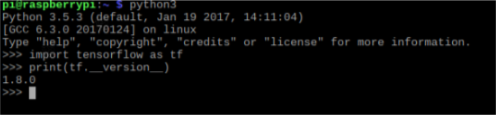
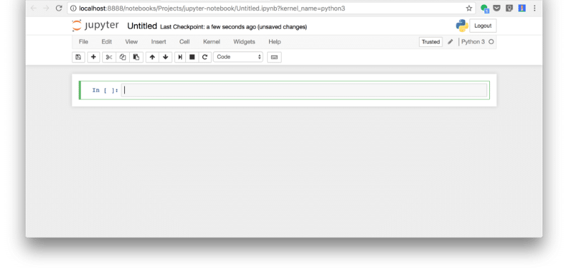

## Dự án 01: Xây dựng Raspberry PI thành máy tính cho Data Scientist (PIDS)

## Bài 01. Cài đặt TensorFlow và các thư viện cần thiết

##### Người soạn: Dương Trần Hà Phương

##### Website: [Mechasolution Việt Nam](https://mechasolution.vn)

##### Email: mechasolutionvietnam@gmail.com

---

## 1. Mở đầu

Nếu bạn muốn chạy một Neural network model hoặc một thuật toán dự đoán nào đó trên một hệ thống nhúng thì Raspberry PI là một lựa chọn hoàn hảo cho bạn.

Chỉ cần lựa chọn phiên bản Raspberry phù hợp với dự án của bạn. Sau đó, cài đặt hệ điều hành mới nhất và xong. Bạn đã sẵn sàng để khám phá thế giới Raspberry kì diệu rồi đó.

## 2. Yêu cầu cần thiết

**Hệ điều hành: Raspbian**

- Tải xuống phiên bản mới nhất của hệ điều hành Raspbian tại [ĐÂY](https://downloads.raspberrypi.org/raspbian_latest)
- Sử dụng [Etcher](https://etcher.io/) để copy Raspbian lên thẻ nhớ (MicroSD)
- Tham khảo cách cài đặt và chạy Raspbian tại bài viết [**Thiết lập Raspberry PI**](https://mechasolution.vn/Blog/bai-1-thiet-lap-raspberry-pi)

**Python**

- Ở đây chúng ta sẽ dùng Python làm ngôn ngữ chính để lập trình vì nhiều lý do như: hiện thực thuật toán nhanh, đơn giản, hệ thống thư viện hỗ trợ đa dạng.
- Phiên bản Raspbian mới nhất ([2018–04–18-raspbian-stretch](https://downloads.raspberrypi.org/raspbian_latest)) đã được cài đặt 2 phiên bản Python là Python 3.5.2 và 2.7.13. Ở đây tôi sử dụng phiên bản Python 3.5.x để demo.

## 3. Cài đặt TensorFlow

[**TensorFlow**](https://www.tensorflow.org/) là một hệ thống chuyên dùng để tính toán trên đồ thị (graph-based computation). Một ví dụ điển hình là sử dụng trong máy học (machine learning).

Ở đây, tôi sử dụng **Python Wheel Package (\*.WHL)** được cung cấp bởi [lhelontra](https://github.com/lhelontra) tại [tensorflow-on-arm](https://github.com/lhelontra/tensorflow-on-arm)

### \* Với Raspberry PI 2 / 3

###### ♦ Với Python version 3.5.x

> `wget https://github.com/lhelontra/tensorflow-on-arm/releases/download/v1.8.0/tensorflow-1.8.0-cp35-none-linux_armv7l.whl`

> `sudo pip3 install tensorflow-1.8.0-cp35-none-linux_armv7l.whl`

> `sudo pip3 uninstall mock`

> `sudo pip3 install mock`

###### ♦ Với Python version 2.7.x

> `wget https://github.com/lhelontra/tensorflow-on-arm/releases/download/v1.8.0/tensorflow-1.8.0-cp27-none-linux_armv7l.wh`

> `sudo pip3 install tensorflow-1.8.0-cp35-none-linux_armv7l.whl`

> `sudo pip3 uninstall mock`

> `sudo pip3 install mock`

### \* Với Raspberry PI One / Zero

###### ♦ Với Python version 3.5.x

> `wget https://github.com/lhelontra/tensorflow-on-arm/releases/download/v1.8.0/tensorflow-1.8.0-cp35-none-linux_armv6l.whl`

> `sudo pip3 install tensorflow-1.8.0-cp35-none-linux_armv6l.whl`

> `sudo pip3 uninstall mock`

> `sudo pip3 install mock`

###### ♦ Với Python version 2.7.x

> `wget https://github.com/lhelontra/tensorflow-on-arm/releases/download/v1.8.0/tensorflow-1.8.0-cp27-none-linux_armv6l.whl`

> `sudo pip3 install tensorflow-1.8.0-cp27-none-linux_armv6l.whl`

> `sudo pip3 uninstall mock`

> `sudo pip3 install mock`

Sau khi cài đặt xong, bạn có thể kiểm tra xem mình có cài đặt thành công không bằng cách import TensorFlow và in ra phiên bản hiện tại (như hình):

## 4. Cài đặt Jupyter Notebook

[Jupyter Notebook](http://jupyter.org/) là một ứng dụng web mã nguồn mở cho phép bạn tạo hoặc chia sẻ những văn bản chứa:

- live code
- mô phỏng
- văn bản diễn giải

Sau đó, bạn chạy các lệnh dưới đây trên Terminal:

> `pip3 install --upgrade pip`

> `reboot`

> `sudo pip3 install jupyter`

Khi cài đặt xong, chạy dòng lệnh dưới đây để khởi động Jupyter Notebook

> `jupyter notebook`

Kết quả, bạn sẽ thấy trình duyệt web được mở lên cùng với giao diện Jupyter Notebook như sau:

Xem bài viết [Sử dụng Jupyter Notebook cho Python](https://mechasolution.vn/Blog/bai-3-su-dung-jupyter-notebook-cho-python) để xem thêm về cách sử dụng Jupyter Notebook

## 5. Cài đặt các thư viện cho Data Scientist

Có rất nhiều thư viện dành trong lĩnh vực Data Science nhưng ở đây tôi chỉ cài đặt những thư viện thông dụng và hữu ích nhất:

** \* Scipy (Commits: 17213, Contributors: 489)**: thư viện dành cho các nhà khoa học và kĩ sư. SciPy bao gồm các modules: linear algebra, optimization, integration, and statistics

> `sudo pip3 install scipy`

** \* Pandas (Commits: 15089, Contributors: 762)**: là một thư viện được thiết kế để làm việc với dữ đơn giản và trực quan. Đây là một công cụ hoàn hảo cho việc trao đổi dữ liệu. Nó được thiết kế để thao tác dữ liệu nhanh chóng và dễ dàng, tập hợp và trực quan hóa.

> `sudo pip3 install pandas`

** \* Matplotlib (Commits: 21754, Contributors: 588)**: là một thư viện hỗ trợ trực quan hoá dữ liệu một cách đơn giản nhưng không kém phần mạnh mẽ. Với một chút nỗ lực, bạn có thể trực quan hoá bất kỳ dữ liệu nào: Line plots; Scatter plots; Bar charts and Histograms; Pie charts; Stem plots; Contour plots; Quiver plots; Spectrograms.

> `sudo pip3 install matplotlib`

** \* Scikit-learn (Commits: 21793, Contributors: 842)**: là các gói bổ sung của SciPy Stack được thiết kế cho các chức năng cụ thể như xử lý hình ảnh và Machine learning.

> `sudo pip3 install -U scikit-learn`

** \* Seaborn (Commits: 1699, Contributors: 71)**: là một thư viện dựa trên Matplotlib nhưng nó chú yếu tập trung vào trực quan hoá các mô hình thống kê. Ngoài ra, Seaborn còn cung cấp cho người dùng những bảng phối màu đẹp và hợp với mắt người nhìn.

> `sudo pip3 install seaborn`

### Tham khảo:

- https://medium.com/@abhizcc/installing-latest-tensor-flow-and-keras-on-raspberry-pi-aac7dbf95f2

- https://medium.com/activewizards-machine-learning-company/top-15-python-libraries-for-data-science-in-in-2017-ab61b4f9b4a7

---

Nếu có thắc mắc hoặc góp ý, các bạn hãy comment bên dưới để bài viết có thể được hoàn thiện hơn.
Xin cảm ơn,

Hà Phương - Mechasolution Việt Nam.
